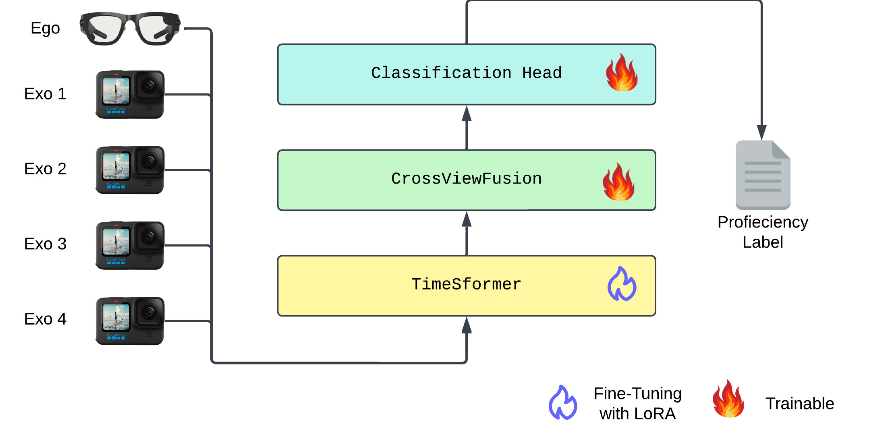

# 🎯 SkillFormer: Unified Multi-View Video Understanding for Proficiency Estimation

**SkillFormer** is a parameter-efficient transformer for unified multi-view proficiency estimation. Leveraging the TimeSformer backbone enhanced with our novel **CrossViewFusion** module, it fuses egocentric and exocentric video features using multi-head cross-attention and adaptive gating. Through Low-Rank Adaptation (LoRA), SkillFormer achieves **SOTA performance** on EgoExo4D while training with **4.5× fewer parameters** and **3.75× fewer epochs**—making robust skill assessment accessible for real-world deployment.

<p align="center">
📄 <a href="https://arxiv.org/abs/2505.08665">Read the Paper</a> | 🌐 <a href="https://edowhite.github.io/SkillFormer">Project Page</a>
</p>

<p align="center">

</p>

## 📊 Key Results

### 🎯 State-of-the-Art Performance
- **+16% accuracy** improvement in Ego+Exo settings
- **+14% accuracy** improvement in Exo settings

### ⚡ Computational Efficiency
- **4.5× fewer** training parameters
- **3.75× fewer** training epochs

---

## 🔍 Highlights

- 🧠 **TimeSformer Backbone Fine-Tuned with LoRA**  
  Efficient low-rank adaptation (LoRA) allows fast, low-resource fine-tuning while retaining the benefits of large pretrained video transformers.

- 🧲 **Attentive Projector for Unified Multi-View Fusion**  
  A custom fusion module that integrates view-specific video features using:
  - Multi-Head Cross-Attention 🧩
  - Learnable Gating Mechanisms 🚪
  - Adaptive Sel-Calibration for Dynamic View Weighting 🎛️

---

## 🔧 Fine-Tuning Data

The model is fine-tuned on the [EgoExo4D](https://ego-exo4d-data.org) dataset, specifically on the "Proficiency Estimation" benchmark. This benchmark includes expert commentary paired with a proficiency label. The fine-tuning process trains the model to produce a proficiency label.

---

## 📁 Project Structure

- `model.py`: Defines `SkillFormer`
- `annotation/prepare_annotation.py`: Prepares data annotations in `.jsonl` format

---

## 🚀 Usage

### 1. Download Data and Prepare annotations
First get access to the dataset and install the required download utilities, following the [official documentation](https://docs.ego-exo4d-data.org).
Second, download the required set of data using the following command:

```bash
egoexo -o ./EgoExoData --benchmarks proficiency_demonstrator --parts downscaled_takes/448 annotations -y
```

Finbally, run the following command to prepare the annotations for training and validation:

```bash
python prepare_annotation.py \
  --input path/to/raw_annotations.json \
  --output path/to/annotations.jsonl
```

### 2. Train the Model
```bash
python model.py \
    --do_train \
    --train_annotation_path annotation_train.jsonl \
    --val_annotation_path annotation_val.jsonl \
    --test_annotation_path annotation_test.jsonl \
    --video_root /data/users/edbianchi/EgoExoData \
    --camera_indices 0 \
    --num_frames 64 \
    --epochs 4 \
    --output_dir ./trained_models/SkillFormer \
    --batch_size 4 \
    --gradient_accumulation_steps 4 \
    --lora_r 32 \
    --lora_alpha 64 \
    --lora_dropout 0.1 \
    --projector_hidden_dim 1536 \
    --projector_num_heads 16 \
    --learning_rate 5e-5 \
    --lr_scheduler_type cosine \
    --weight_decay 0.01 \
    --warmup_ratio 0.10 \
    --optim adamw_torch \
    --logging_steps 50 \
    --do_inference
```

> You can resume the training of an experiment by adding the ```--resume_from_checkpoint``` argument. The last chekcpoint of the specified ```--run_name``` will be loaded.

### 3. Inference
Run inference using the following command.

```bash
python model.py \
    --test_annotation_path annotation_val.jsonl \
    --video_root /EgoExoData \
    --camera_indices 0 \
    --num_frames 32 \
    --output_dir ./trained_models/SkillFormer \
    --model_path ./trained_models/SkillFormer \
    --batch_size 4 \
    --do_inference
```

> **Note**: Ensure that the `--camera_indices` and `--num_frames` values match the configuration used during model training to avoid inconsistencies in input processing.

---

## 🧪 Citation

```
@misc{bianchi2025skillformerunifiedmultiviewvideo,
      title={SkillFormer: Unified Multi-View Video Understanding for Proficiency Estimation}, 
      author={Edoardo Bianchi and Antonio Liotta},
      year={2025},
      eprint={2505.08665},
      archivePrefix={arXiv},
      primaryClass={cs.CV},
      url={https://arxiv.org/abs/2505.08665}, 
}
```

---

## 📬 Contact

For questions or collaborations, open an issue or contact us at [edbianchi@unibz.it] or [edoardobianchi98@gmail.com].

---

💡 *SkillFormer is designed with research in mind. Contributions are welcome!*